<!---
  SPDX-FileCopyrightText: (C) 2025 Intel Corporation
  SPDX-License-Identifier: Apache-2.0
-->

# Intel® Geti™ Computer Vision Platform

This repo contains a Deployment Package to deploy [Intel® Geti™](https://github.com/open-edge-platform/geti) 2.10.1
to an Edge Node using the [Edge Manageability Framework](https://github.com/open-edge-platform/edge-manageability-framework) (EMF) 3.1 or greater.

This document is an extension of the [Geti Installation Guide for Helm charts](https://docs.geti.intel.com/docs/user-guide/getting-started/installation/using-helm-charts)
and extends it to the Edge Node environment.

## Overview

The EMF Edge Node is more secure than a standard Kubernetes cluster, and with its own Cert Manager, and
Network Policies and Gatekeeper enforcing security policies.

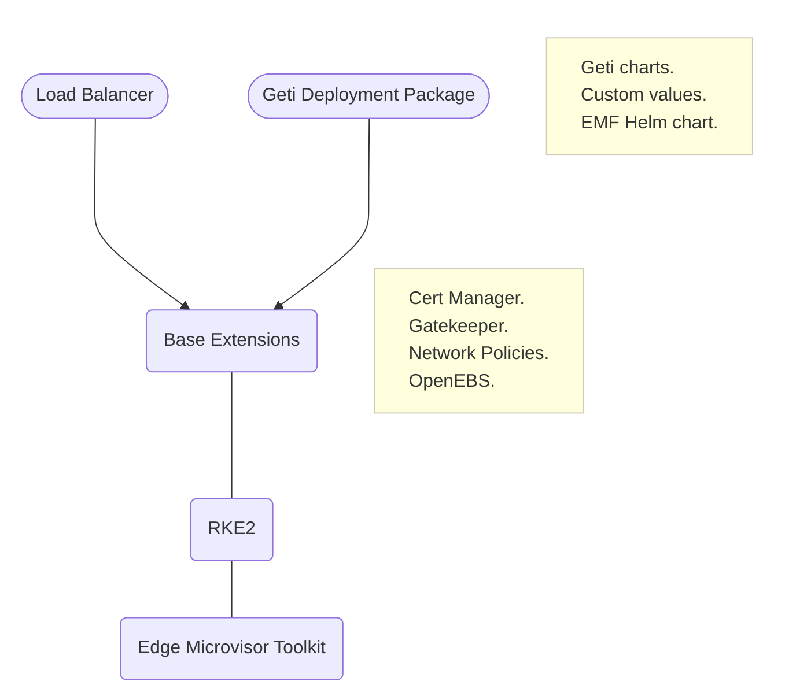

The goal of this integration is to preserve the integrity of the security measures that Geti has
in it's on-prem installed form, while also keeping the security measures of the EMF Edge Node.

Geti's service mesh in Istio and the Istio Gateway are maintained, while reusing the Cert Manager
of the Edge Node. Edge Node Calico network policies are maintained. Edge Node's Metallb load balancer
is integrated with Geti's Istio Gateway.

Geti's account management, IAM and storage are also maintained, while Edge Node's GateKeeper is
also active.

Together this means that previous security reviews for Geti on-prem and Edge Node can be reused.

## Prerequisites

### Orchestrator

This document assumes the user has `Edge Cluster Manager` access level to an EMF
Orchestrator of Release 3.1 or greater.

The guide generally follows typical Application deployment workflow of the
[Orchestrator User Guide](https://docs.openedgeplatform.intel.com/edge-manage-docs/main/user_guide/package_software/deployments.html)

### Edge Node

The Intel® Geti™ deployment requires at least one Edge Node with:

- 20 cores
- 128 GB RAM
- 1 TB hard disk


The Edge Node should be on-boarded properly in to the EMF Platform and appear in the list
of "Provisioned Hosts" in Infrastructure. Either **Edge Microvisor** or **Ubuntu** can
be used as the OS.

It is recommended to [add an SSH](https://docs.openedgeplatform.intel.com/edge-manage-docs/main/user_guide/additional_howtos/configure_ssh_public_keys.html)
key to the Edge Node to allow for easier access.

### Cluster deletion

If there is an existing Cluster on the Edge Node it should be deleted.

## Cluster Creation

Use the Orchestrator UI to create the Cluster, choosing correct Edge Node and `privileged` Cluster Template.

> The `baseline` or the `restricted` cluster template cannot be used for Geti.
> It can only use the `privileged` template.

Once ready you can explore the details.

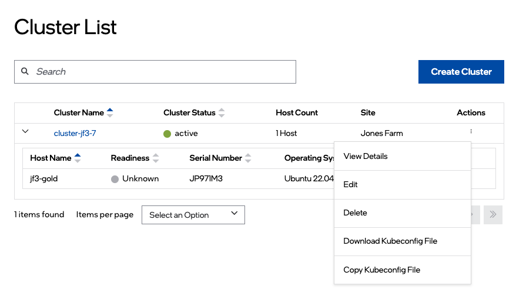

After creation or the cluster, [download the Kubeconfig](https://docs.openedgeplatform.intel.com/edge-manage-docs/main/user_guide/set_up_edge_infra/accessing_clusters.html)
to access the cluster from your terminal.

```shell
export KUBECONFIG=<downloaded file name>

kubectl cluster-info
```

## Getting the Node IP address

Intel® Geti™ web front end and API is exposed through a Load Balancer in this deployment on EMF.

This requires an IP address to be specified at deployment time. Depending on the installation environment, spare IP
addresses could be used, or a new one could be requested from the network team.

In a simple deployment scenario, the exiting IP address of the Edge Node can be used.

To get this address run:

```shell
kubectl get $(kubectl get nodes -o name ) -o yaml | yq '.status.addresses'
```

## Deploying Load Balancer

The EMF uses MetalLB as a Load Balancer for the Edge Node. This **must** be deployed
on to the Edge Node before deploying Intel® Geti™. More information is available in [LoadBalancer] documentation.

The Load Balancer is available as an Extension that is preloaded in to the Edge Orchestrator.

To deploy the Load Balancer, use the Orchestrator Web UI as described in the Orchestrator User Guide.

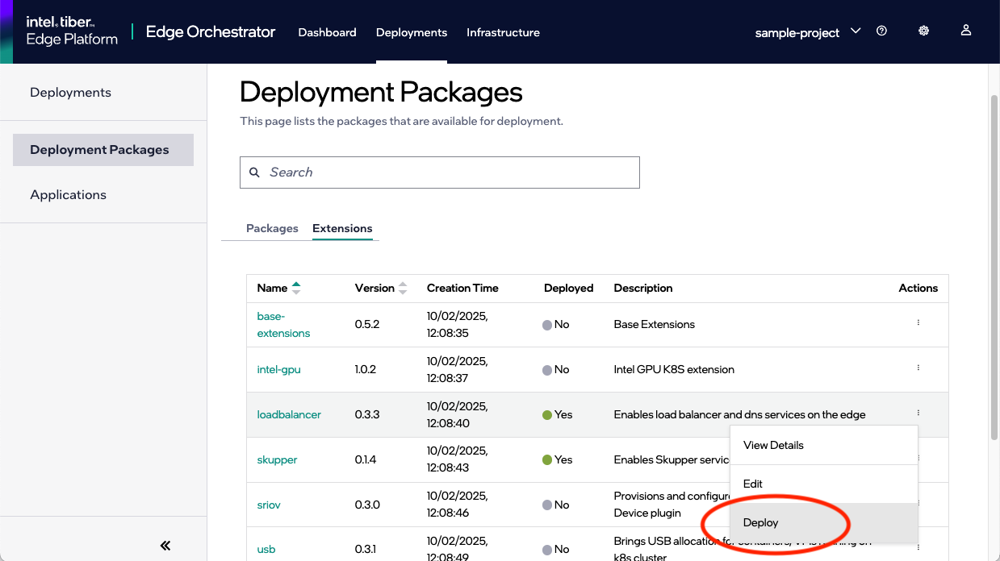

In a simple setup where interconnectivity between Edge Nodes is not required, the Load Balancer
can be deployed with a single IP address. In this simple deployment scenario the Edge Node's IP address from above can be
specified as the override parameter **Range of IP addresses used for exposing services** for
`metallb-config`. Note that in the case of a single IP Address it must be specified in CIDR format (ending with `/32`).

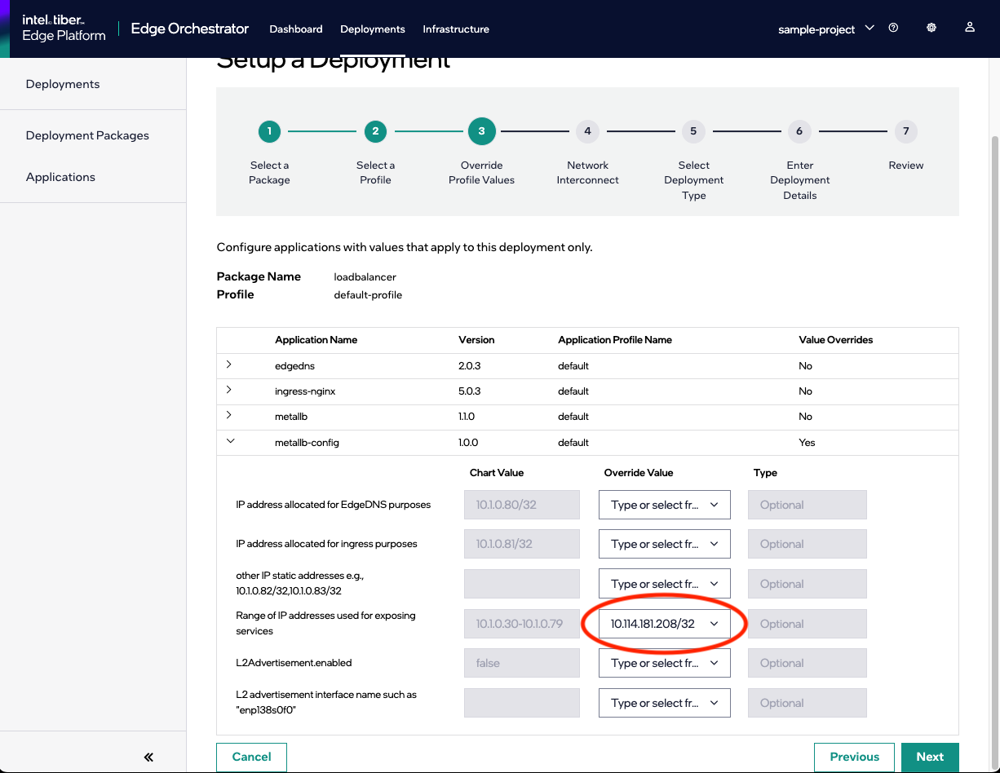

After deployment the status of the Load Balancer will be shown as `Running`.

For more complex setups where interconnectivity between Edge Nodes is required, see the [dedicated section](#deploying-intel-geti-with-interconnectivity).

## Deploying Intel® Geti™

Intel® Geti™ is a complex and highly secured application and is deployed through the
[Deployment Package "geti"](deployment-package/geti-deployment-package.yaml) in this repo.

Once it has been imported in to the Orchestrator it can be seen in the list of Deployment Packages.

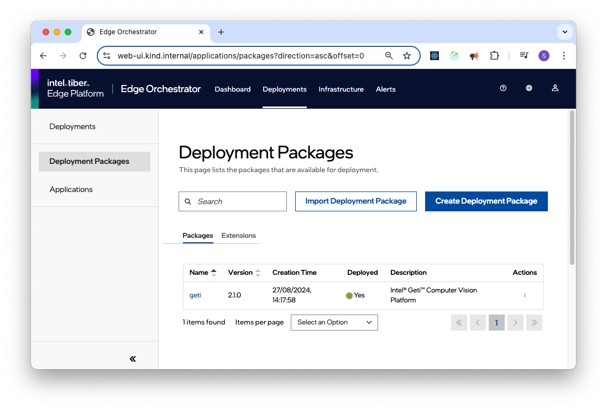

Intel® Geti™ Deployment Package comprises many Applications, most of which install in parallel,
and some of which are dependent on each other:

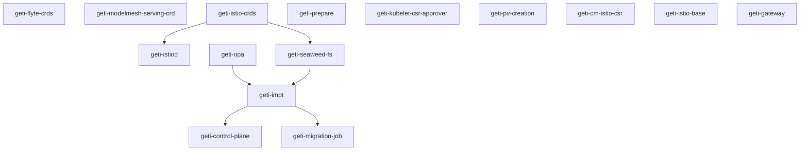

To install it, use the Orchestrator Web UI as described in the Orchestrator User Guide.

> If for some reason the deployment does not complete properly, it is necessary to undeploy the deployment AND
> delete the cluster before retrying an installation.
> See [Reinstall](#reinstalling-intel-geti) section below.

In `geti-istiod` profile, override the Parameter template for:

- `Node IP CIDR`.
    - The value must be in CIDR format (ending with `/32`).

In `geti-control-plane` profile, override the Parameter template for:

- `Email for admin user login` - An Admin user in the format of an email address.
    - This will be used to initialize the Geti Identity and Access management system.

- `Initial password for admin user` (Give an admin password. Password must
  have 8-200 characters, at least one capital letter, lower letter, digit and symbol)

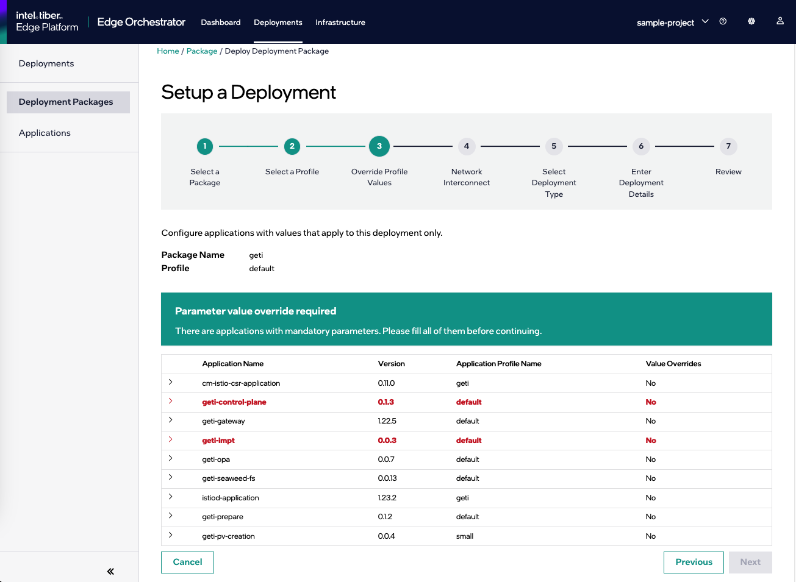

After a few minutes the deployment will start and should take about 15 minutes.
While you wait it can be interesting to watch the progress with:

```shell
watch kubectl -n impt get pods
```

In the Orchestrator Web UI you will be able to track the installation of these Applications in the Deployment
details view.

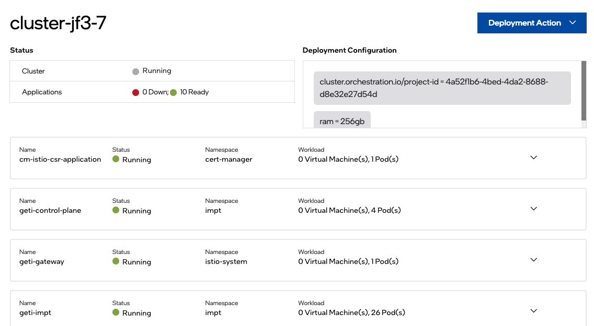

After all go Green the status will be shown as `Running` and Intel® Geti™ is fully deployed.

> If the Edge Node is shutdown, when it is restarted the Orchestrator might show that the deployment
> is down. Please follow the troubleshooting section on
> [flyte-pod-webhook pod in CrashLoopBackoff](#flyte-pod-webhook-pod-in-crashloopbackoff) to recover.

## Accessing Intel® Geti™

The Intel® Geti™ Web UI is available at the IP address or Host name of the Edge Node
(the address entered at deployment time above).

## Using Intel® Geti™

Browse to the Hostname or IP address with Https

> Accept the invalid cert if necessary

Login with the admin email and password you gave at deployment time above.

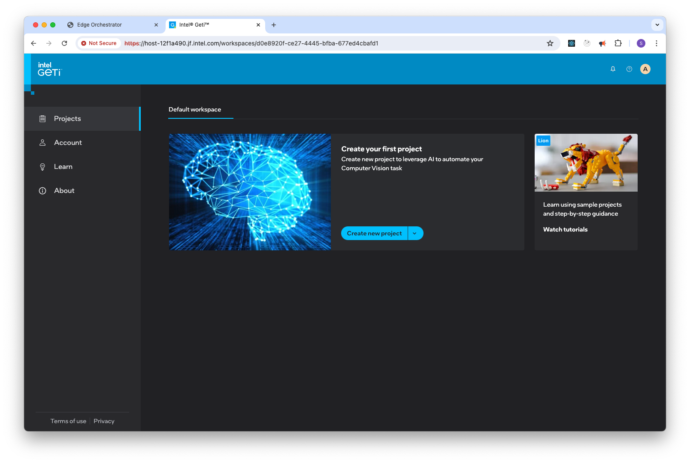

Documentation can be accessed through the `?` icon at the top of the screen, or directly on the
web at [docs.geti.intel.com](https://docs.geti.intel.com/on-prem/2.0/guide/get-started/introduction.html)

## Uninstalling Intel® Geti™

To uninstall Intel® Geti™ from the EMF Platform:

- First **delete** the `geti` Deployment using the Orchestrator Web UI
- Then **undeploy** the Load Balancer using the Orchestrator Web UI
- Then delete the Cluster using the Orchestrator Web UI

## Reinstalling Intel® Geti™

Firstly Intel® Geti™ deployment package and Load Balancer **and** Cluster should be deleted as above.

## Deploying Intel® Geti™ with Interconnectivity

This section is for more complex setups where interconnectivity between Edge Nodes is required. Interconnectivity is
provided by the Interconnect feature of the Edge Orchestrator which is described at [Interconnect] documentation.

The use case for deploying Geti with Interconnect is where a corresponding client application that needs to access the
Geti API will be deployed to one or more other Edge Nodes. The other Edge Nodes will be onboarded to the same Project on
the same Orchestrator. When deploying these client applications to the other Edge Nodes there will be a Network object
specified that links them to Geti using Skupper.

There are 6 steps to deploying Geti with Interconnect:

- Acquiring necessary IP addresses
- Creating a Network Object
- Deploying the Skupper extension
- Creating of the Cluster for Geti
- Deploying Load Balancer with Interconnect
- Deploying Intel® Geti™ with Interconnect

### Acquiring necessary IP addresses

This deployment requires 2 or more IP addresses to be specified at deployment time.
One of these IP addresses can be the Edge Node's IP address from above.

The other IP address can be a spare IP address or a new one requested from the network team. If more than 1 is available
they should be contiguous (i.e. can be specified in a range format like `10.1.2.3-10.1.2.5`). The addresses should not
be in use by any other services on the network.

The need for these IP addresses stems from the fact that both Interconnect and Geti gateway require a Load Balancer.

For the sake of illustration we will assume that the Edge Node's IP address is `10.23.21.125` and that we have been given
spare IP addresses by the network team `10.23.21.45-10.23.21.47`. In this case the extra addresses are from the same subnet
as the Edge Nodes IP address - this is not required to be the case.

> The case for specifying more than 1 IP address is that the Load Balancer may also need to be used by other deployed
> applications on the same Edge Node cluster.

### Creating a Network Object

Skupper is configured by Network objects. This cannot currently be created in the Orchestrator UI and must be
done by API call. See the [Interconnect] documentation for more information.

In the example below we assume the Network object is named `network-geti`.

### Deploying the Skupper extension

The Skupper extension is required to be deployed to all the Edge Nodes that need to participate in Interconnectivity.
It is available as an Extension that is preloaded in to the Orchestrator, and can be deployed using the Orchestrator
Web UI.

> When deploying Skupper extension do not select the Network object you created.

It is convenient to use Automatic deployment for Skupper, as it will automatically deploy the Skupper extension to all
Edge Nodes clusters that have a matching tag e.g. `interconnect: true`.

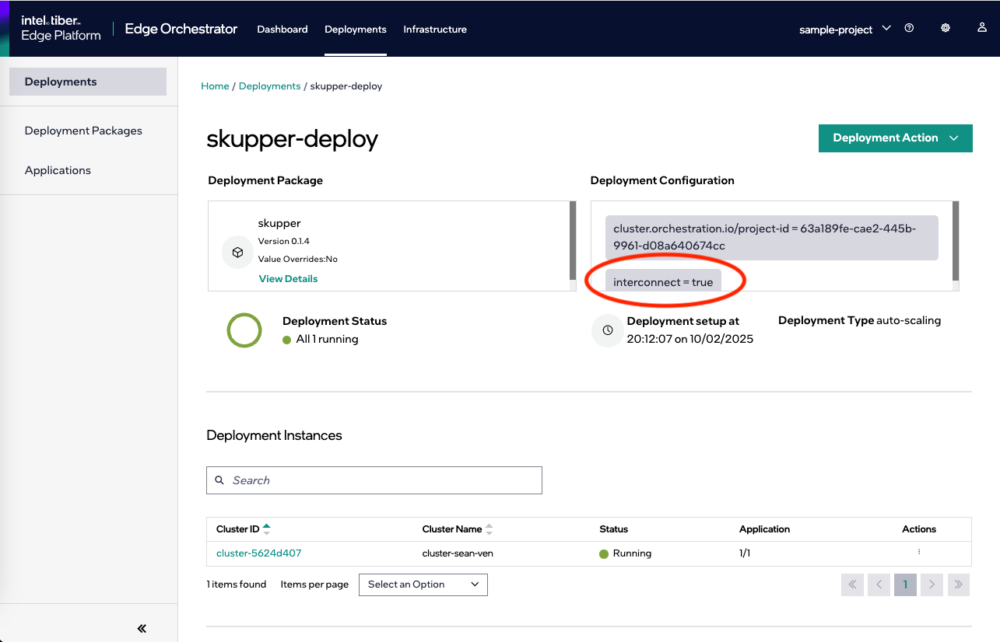

### Creating of the Cluster for Geti

As with the simple deployment, this expects that the Edge Node is already on-boarded to the Orchestrator and that the
Cluster does not exist on it.

The Cluster should be created with the `privileged` Cluster Template, and in the Deployment metadata a key should be
specified as `interconnect: true`, so that the Skupper extension will automatically deploy to it.

### Deploying Load Balancer with Interconnect

Deploying the Load Balancer with Interconnect is a little different to the simple deployment above. In the `metallb-config`
override parameters:

- the spare IP address range should be specified in **Range of IP addresses used for exposing services**.
    - It can be specified as a range if more than one is available (and other deployed applications may need an address)
    - Or it can be specified in CIDR format it is a single address (ending with `/32`).
- the **L2Advertisement.enabled** should be set to `true`
- the **L2 advertisement interface name such as "enp138s0f0"** should be set to the interface name of the Edge Node's
  network adapter.
    - This interface name can be found by through the Orchestrator UI in the Infrastructure section. In the appropriate
      host's details the network adapter name is shown.
    - This step is necessary to ensure that the Load Balancer can advertise the IP addresses to the network.

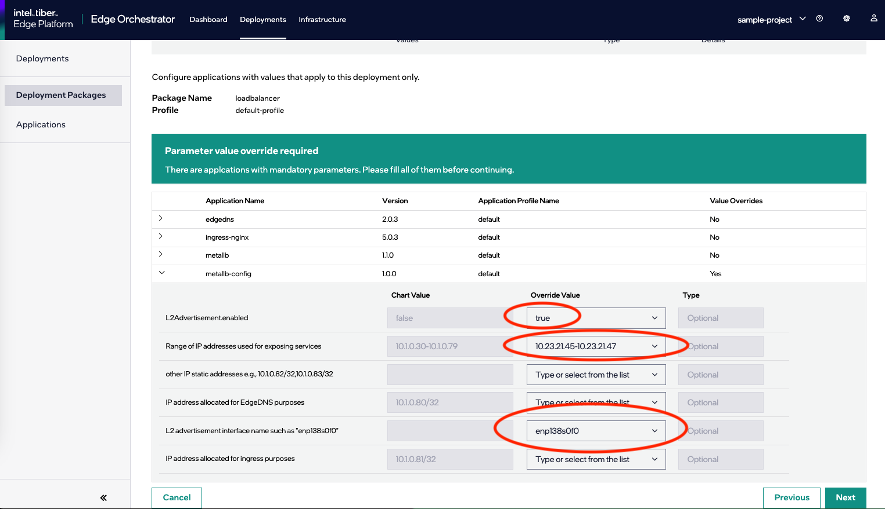

> When deploying Load Balancer extension do not select the Network object you created.

### Deploying Intel® Geti™ with Interconnect

After the load balancer has been set up the Intel® Geti™ deployment needs to be configured slightly differently.

In the override parameters for `geti-istiod` on the deployment setup page:

- **Node IP CIDR** should be set to the Edge Node's IP address in CIDR format (i.e. ending in `/32`).

In the override parameters for `geti-prepare` on the deployment setup page:

- **IP address of target Edge Node** should be set to the Edge Node's IP address.
- **Enable extra metallb address** should be set to `true`
- **Enable Interconnect Service** should be set to `true`

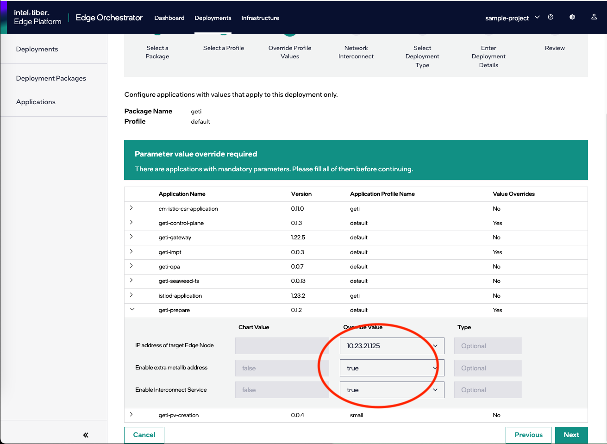

On the next page **Network Interconnect** select the Network object created earlier, and specify that `geti-prepare` should
have its service exposed.

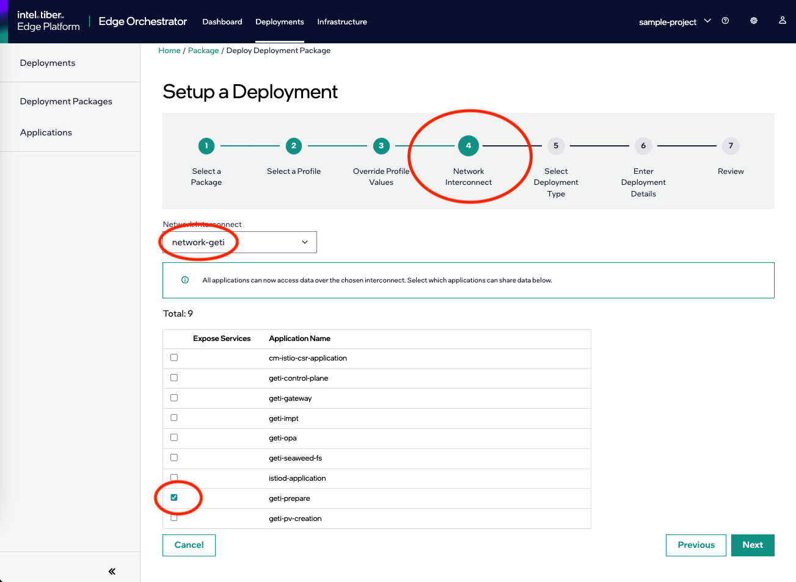

From this point on the deployment should proceed as normal.

When Geti is deployment has completed, it should be possible to access the Web UI from any of the IP addresses specified
for the Edge Node.

### Reinstalling Intel® Geti™ with Interconnect

Similar to the simple Geti installation scenario, the re-installation of Geti requires the undeployment of Geti and also
of the load balancer, and then the deletion of the cluster. Skupper extension need not be deleted if it was installed
automatically. Likewise, the Network object does not need to be deleted.

## Troubleshooting

### kubectl cannot connect to Cluster

- Check that `KUBECONFIG` environment variable is set properly.
- Check the downloaded kubeconfig file.
- Check there is not a proxy error
- Check that the kubeconfig.yaml file downloaded has not expired (they only last for 1 day)

### istio-gateway in ImagePullBackOff

If Istio Gateway is in `ImagePullBackOff` state, it is likely that is trying to pull
an image called `auto` (which is invalid). This can be remedied by restarting the pod.

### geti-seaweed-fs not deploying

After you deploy the `geti` deployment package and see that `geti-seaweed-fs` application
is still down after 5 minutes it might be because the `geti-pv-creation` bundle might not
have deployed and is still in `Wait Applied`.

Check if the PVC exists (if it does, the problem lies elsewhere and a reinstall is the recommended solution:

```shell
kubectl -n impt get pvc data-storage-volume-claim
```

To fix it, over on the Edge Node try restarting the `fleet-agent-0` in the
`cattle-fleet-system` namespace by deleting it:

```shell
kubectl -n cattle-fleet-system delete pod fleet-agent-0
```

This should cause the `geti-pv-creation` bundle to be deployed, and you can check
if the PVC exists again:

```shell
kubectl -n impt get pvc data-storage-volume-claim
```

At this stage the `geti-seaweed-fs` application should be up and running, but the job
for bucket creation will need to be restarted. This can be done by deleting the Job:

```shell
kubectl -n impt delete job geti-seaweed-fs-bucket-creation
```
This will cause the job to be re-created and run again.

It may take some minutes to recover, but eventually the `geti-seaweed-fs` application should be up and running.

### 404 Error on accessing Intel® Geti™ Web UI

This is usually caused not entering a valid IP Address when deploying the application.

See [section on deployment](#deploying-intel-geti)

### flyte-pod-webhook pod in CrashLoopBackoff

This can happen if the Edge Node is shutdown and restarted after Geti has been deployed to it.

First verify the problem:

```shell
kubectl -n flyte logs $(kubectl -n flyte get pods -l app=flyte-pod-webhook -o name) --tail=20
```

Expect this to show something like:

```json
{"json":{},"level":"fatal","msg":"Failed to start webhook. Error: mutatingwebhookconfigurations.admissionregistration.k8s.io \"flyte-pod-webhook\" already exists","ts":"2024-08-02T09:55:34Z"}
```

Manually delete the `mutatingwebhookconfigurations/flyte-pod-webhook`:

```shell
kubectl -n flyte delete mutatingwebhookconfigurations.admissionregistration.k8s.io flyte-pod-webhook
```

The pod should change to running in 6 minutes or less, and the deployment will repair itself.

## Active issues

There are a number of issues open on both ITEP and Geti to address some of these manual steps.

[Interconnect]: https://docs.openedgeplatform.intel.com/edge-manage-docs/main/user_guide/package_software/interconnect.html
[LoadBalancer]: https://docs.openedgeplatform.intel.com/edge-manage-docs/main/user_guide/package_software/extensions/load_balancer.html