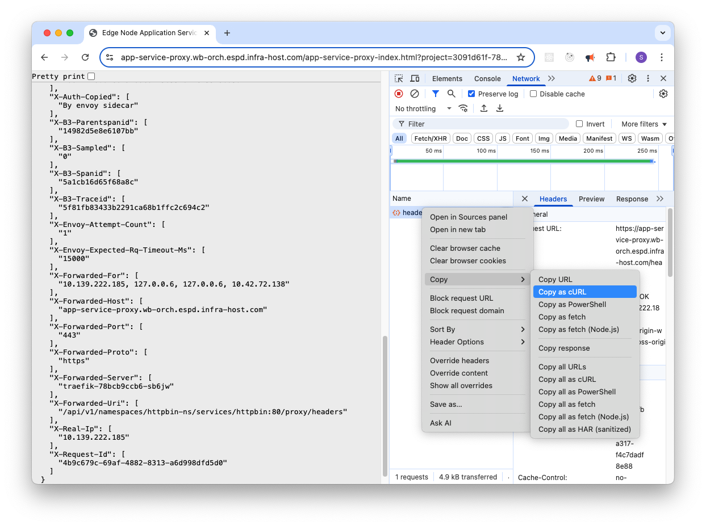

<!---
  SPDX-FileCopyrightText: (C) 2025 Intel Corporation
  SPDX-License-Identifier: Apache-2.0
-->

# httpbin

Deployment Package and Helm Chart for Httpbin Go. This is a general purpose tool useful for testing and
debugging HTTP requests and responses.

It is recommended to install it as a Deployment Package on Edge Manageability Framework and 
access it through
[Service Link](https://docs.openedgeplatform.intel.com/edge-manage-docs/main/user_guide/package_software/package_create_helm.html#service-link-support-application-service-proxy)
, a feature of Edge Manageability Framework that allows you to connect to a service through App Service Proxy.

If the application is deployed through Edge Manageability Framework and the service link is created, you can access it in
the Web UI as in the Deployment details under Endpoint.

## Helm Chart

The Helm chart deploys image `mccutchen/go-httpbin` and adds
an Envoy proxy sidecar that sets the `Authorization` header removed by Kube API proxy.

See more details [here](../../open-edge-platform/app-orch-catalog/app-orch-tutorials/httpbin/helm/README.md).

To use the chart package it and upload it to your local OCI registry:

```bash
helm package helm
```

Upload the package to your local OCI registry following the instructions
[here](https://docs.openedgeplatform.intel.com/edge-manage-docs/main/user_guide/package_software/push_registry.html)

### Deployment Package

The deployment package is designed to be used on Edge Manageability Framework.

It refers to the Helm Chart in the [application.yaml](../../open-edge-platform/app-orch-catalog/app-orch-tutorials/httpbin/deployment-package/app-httpbin.yaml) file.

> This should be kept in sync with the version and location of the Helm Chart.
 
# Deploying

When deploying there are 2 choices - with Envoy Proxy or without.

The Envoy Proxy:

- Set the Authorization Header to the value of the `X-App-Authorization` header in the request.
  - This is required for the Kube API proxy to work correctly, and since App Service Proxy is
    dependent Kube API it needs this for the `/bearer` endpoint to work.
- Sets Secure Headers like COOP, COEP, CORP and CSP in the response.
  - These are useful for testing and debugging, but not required for the application to work.

Without these most functions will work.

## Testing /headers

The `/headers` endpoint is used to test the headers sent in the request.

The screenshot below shows the headers sent in the request and how they arrived at the service.

!

> It also shows a handy way to copy the equivalent request over to the command line using the
> `Copy as cURL` feature of the browser.

## Testing /bearer

The `/bearer` endpoint is used to test that the Authorization header is sent down through the Kube API proxy.

In the request to `/bearer` add the request header `X-App-Authorization: Bearer 123` and the
service should respond with:

```json
{
  "authenticated": true,
  "token": "123"
}
```

> The `/headers` endpoint can be used to check the headers reaching the service.
