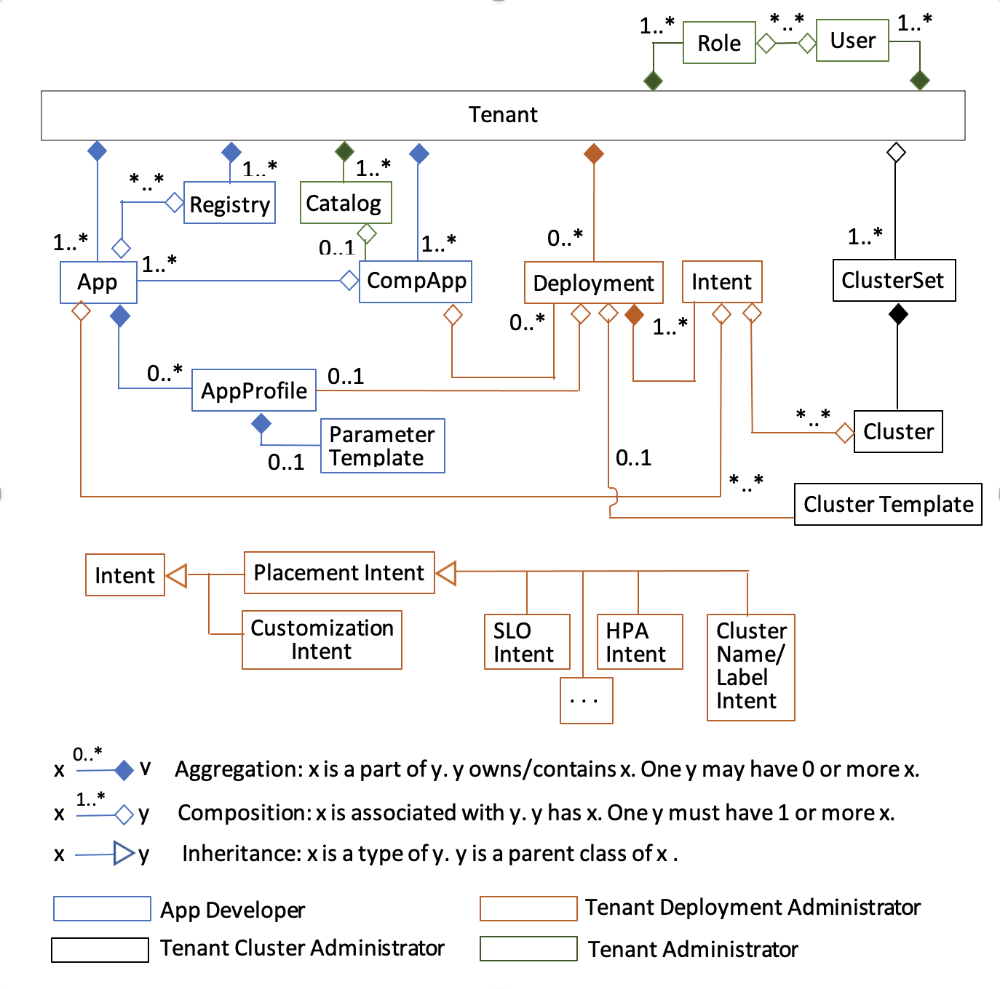

<!---
  SPDX-FileCopyrightText: (C) 2025 Intel Corporation
  SPDX-License-Identifier: Apache-2.0
-->
# Architecture

Application Orchestrator objects and their relationships are depicted in the following UML class diagram.

## Design Decisions

* The project follows the [Golang Standard Project Layout] for its directory structure.
* The source of truth for the API is [protobuf] models found in the [api] directory.
* Code generation is driven by [buf]  which relies on `protoc` and `protoc plugins`
found in [buf.gen.yaml](../buf.gen.yaml).
* [gRPC-Gateway] is used as a reverse proxy that acts as a Restful/JSON
application to the client.
* Catalog uses [PostgreSQL] as the database backend. The database schema is generated using [ent] which

## Security design
### Enforcing the principle of least privilege

Application Catalog enforces the principle of Least Privilege throughout its design:

1. Restrict access to others at Deployment
   Application Catalog is deployed in the orch-app namespace and only has access to other services in that
namespace - but does not even use most of them.
The only services it relies on are
    - the Malware Scanner and
    - the Vault Service (in the orch-platform namespace through a service account), to a minimal level.
    - a Postgress Database external to the cluster (AWS Aurora RDS)

> Note: Malware Scanner is disabled by default but the code is there that you can run it if you want to.

2. Restricted Access to others
   Application Catalog restricts access to its 2 endpoints - the gRPC interface and the REST interface.
   - Only Application Deployment Manager is allowed to access the gRPC interface, and when doing so only
   has access to writing to the Deployment Package to update the 'isDeployed' flag. It is allowed read all resources.
   - Through the REST interface clients must first present a valid JWT token, and then the "roles" listed within the
   token determine the level of access control (RBAC). These access rules are written as Open Policy Agent REGO rules
   that define which role has access to which resources.

## Authentication and Authorization
The details of the Authentication and Authorization implementation are described in the [Authorization] document.

[buf]: https://docs.buf.build/introduction
[protobuf]: https://developers.google.com/protocol-buffers
[grpc]: https://grpc.io/
[grpc-gateway]: https://grpc-ecosystem.github.io/grpc-gateway/
[openapi]: https://swagger.io/docs/specification/about/
[ent]: https://entgo.io/
[PostgreSQL]: https://www.postgresql.org/about/
[Golang Standard Project Layout]: https://github.com/golang-standards/project-layout 
[api]: ../api
[Authorization]: ./authorization.md