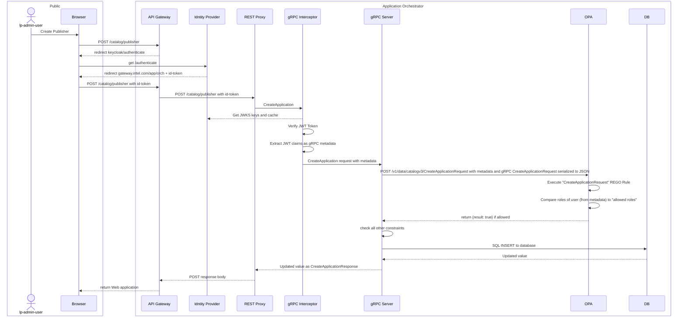
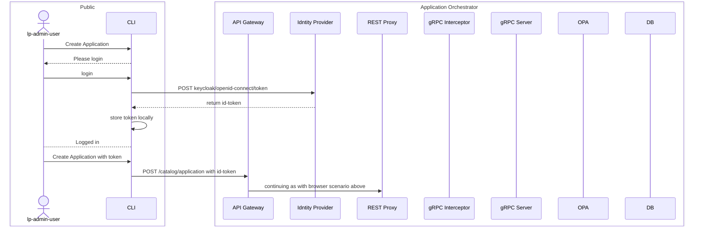

<!---
  SPDX-FileCopyrightText: (C) 2025 Intel Corporation
  SPDX-License-Identifier: Apache-2.0
-->
# Authorization

Authorization is implemented as a Role Based Access Control (RBAC) system in a distributed 
fashion in Application Catalog, by running OpenPolicyAgent as sidecar to the `application-catalog`
container.

## Authentication
Authorization is dependent on the Application Catalog being configured with an Identity Provider, to implement
the Authentication feature.

### Deploying Locally
For deploying locally this may be done by [deploying a local Keycloak](../deployments/keycloak-dev).
Once available, the Application Catalog may be started with:
```shell
OIDC_SERVER=http://keycloak/realms/master make chart-install-kind
```

### Coder deployment 
[Keycloak]
is already configured in this environment

### Cloud deployment (app-configs)
[Keycloak]
is already deployed through Fleet on cloud deployment.

## OPA
A distributed OPA is necessary since Application Catalog is the ultimate source of truth about its managed objects
(such as Application) and the interpretation of the meaning of each of the **roles** that a user
may possess ultimately happens in Application Catalog development.

OpenPolicyAgent runs as a sidecar and optionally exposes its API to the cluster (as a Service), so that Auditing and
Logging may be extracted from it on demand. If the Service is not enabled, the API is still available to the 
`application-catalog` container through `localhost:8181`.

## OPA Triggers
OPA is called upon each time one of the gRPC methods from [service.proto](../api/catalog/v2/service.proto) 
is called.

There are 2 broad categories:

* READ operations (GET or LIST) - the response will be a filtered set of what’s allowed
* WRITE operations – (CREATE, UPDATE, or DELETE) the response will be a Boolean true/false representing allowed or denied

## Roles

Roles are defined by the Keycloak Tenant Manager dynamically as projects are created and deleted.
The relevant roles for App Catalog are:
* **cat-r** - Catalog Read Only
* **cat-rw** - Catalog Read Write
* **reg-r** - Registry Read Only
* **reg-a** - Registry Admin

## Rules in the context of Application Catalog
The rules impart the following relationship between the roles and the managed objects of the Catalog Application as follows:

|        | Registry   | Artifact   | Application | Deployment<br/>Package |
|--------|------------|-------------|-----------------|------------------------|
| cat-rw | **RW all** | **RW all**  | **RW all**              | **RW all**             |
| cat-r  | RO all     | RO all      | RO all                  | RO all                 | 


## Calling on OPA
OPA executes policy decisions using REGO rules applied to data sets.

The 2 major data sets are:
* `input` - provided in JSON format during a query - specifically:
  * `request` - the contents of the gRPC request that is being authorized
  * `metadata` - the contents of the gRPC metadata, including the contents of the JWT token
* `data` - provided in advance and cached in JSON format - the complete contents of the App Calatog DB

All **Write** actions will be checked for authorization by passing the `input` listed above over 
to the OPA Sidecar at a URL matching the Request type name e.g. CreateApplicationRequest. 
OPA will perform the query on this rule, and returns the result to Application Catalog.

If the rule:
* evaluates to `{"result":true}` then access will be granted.
* any other response e.g. `{}` then access will be denied.

### Example of calling the CreateApplication method (a WRITE trigger)


### Example of CreateApplication through CLI


## REGO Rules (Policies)
The REGO rules (policies) are present [in the Helm chart](../deployments/application-catalog/files/openpolicyagent), and
are loaded in a config map in to OPA at startup.

The OPA API `/v1/policy` can be used to update or inspect these at runtime.

### Test rules locally

> The [testdata](../deployments/application-catalog/files/openpolicyagent/testdata) folder shows an example of the kind of input that's expected as a combination of `request` and `metedata`.

Test with:
```shell
opa eval -f pretty -b ~/intel/app-orch-catalog/deployments/application-catalog/files/openpolicyagent \
  --input ~/intel/app-orch-catalog/deployments/application-catalog/files/openpolicyagent/testdata/CreateApplicationInput.json \
  data.catalogv3.CreateApplicationRequest
```

> Many IDEs have support for running these tests in a graphical environment e.g. GoLand or Intellij Idea