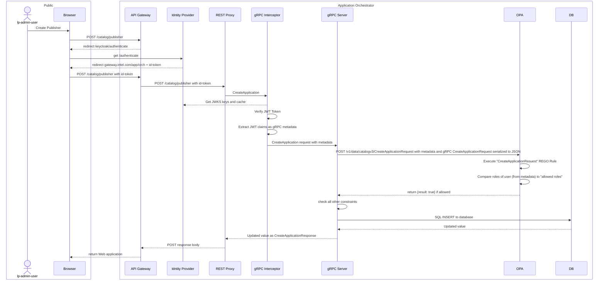
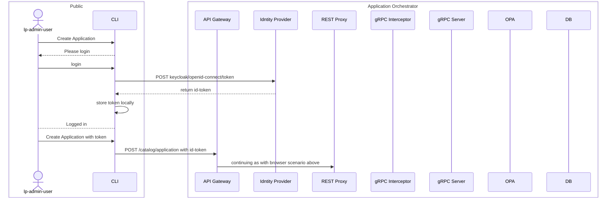

<!---
  SPDX-FileCopyrightText: (C) 2025 Intel Corporation
  SPDX-License-Identifier: Apache-2.0
-->

# Authorization

Authorization is implemented as a Role-Based Access Control (RBAC) system in a distributed
fashion in the Application Catalog by running [Open Policy Agent] as a sidecar to the `application-catalog`
container.

# Authentication

Authorization depends on the Application Catalog being configured with an Identity Provider to implement
the Authentication feature. Authentication is implemented as a gRPC interceptor that verifies the JWT token.
The implementation of the gRPC interceptor is in the [Authentication gRPC Interceptor] package.

## Coder Deployment

[Keycloak] is already configured in this environment.

## Cloud Deployment (app-configs)

[Keycloak] is already deployed through Fleet in the cloud deployment.

## Open Policy Agent (OPA)

A distributed [Open Policy Agent] is necessary since the Application Catalog is the ultimate source of truth about
its managed objects (such as Applications), and the interpretation of the meaning of each of the **roles** that a user
may possess ultimately happens in the Application Catalog.

Open Policy Agent runs as a sidecar and optionally exposes its API to the cluster (as a Service), so that auditing and
logging can be extracted from it on demand. If the Service is not enabled, the API is still available to the
`application-catalog` container through `localhost:8181`.

## OPA Triggers

OPA is called each time one of the gRPC methods from [service.proto](../api/catalog/v3/service.proto)
is invoked.

There are two broad categories:

- READ operations (GET or LIST) - the response will be a filtered set of what’s allowed.
- WRITE operations (CREATE, UPDATE, or DELETE) - the response will be a Boolean true/false representing allowed or denied.

## Roles

Roles are defined dynamically by the Keycloak Tenant Manager as projects are created and deleted.
The relevant roles for the Application Catalog are:

- **cat-r** - Catalog Read-Only
- **cat-rw** - Catalog Read-Write
- **ao-m2m-rw** - Machine-to-Machine Read-Write

## Rules in the Context of the Application Catalog

The rules define the following relationship between the roles and the managed objects of the Catalog Application:

|           | Registry   | Artifact   | Application | Deployment<br/>Package |
|-----------|------------|------------|-------------|------------------------|
| cat-rw    | **RW all** | **RW all** | **RW all**  | **RW all**             |
| cat-r     | RO all     | RO all     | RO all      | RO all                 |
| ao-m2m-rw | **RW all** | **RW all** | **RW all**  | **RW all**             |

## Calling OPA

OPA executes policy decisions using REGO rules applied to data sets.

The two major data sets are:

- `input` - provided in JSON format during a query, specifically:
  - `request` - the contents of the gRPC request being authorized.
  - `metadata` - the contents of the gRPC metadata, including the JWT token.
- `data` - provided in advance and cached in JSON format, containing the complete contents of the Application Catalog database.

All **Write** actions are checked for authorization by passing the `input` listed above to the OPA Sidecar at
a URL matching the Request type name, e.g., `CreateApplicationRequest`.
OPA performs the query on this rule and returns the result to the Application Catalog.

If the rule:

- evaluates to `{"result":true}`, access is granted.
- evaluates to any other response, e.g., `{}`, access is denied.

### Example of Calling the CreateApplication Method (a WRITE Trigger)



### Example of CreateApplication Through CLI



## REGO Rules (Policies)

The REGO rules (policies) are present [in the Helm chart](../deployments/app-orch-catalog/files/openpolicyagent), and
are loaded into a config map in OPA at startup. The OPA API `/v1/policy` can be used to update or inspect these at runtime.

### Test Rules Locally

> The [testdata](../deployments/app-orch-catalog/files/openpolicyagent/testdata) folder shows an example of the kind
> of input expected as a combination of `request` and `metadata`.

Test with:

```shell
opa eval -f pretty -b ~/intel/app-orch-catalog/deployments/application-catalog/files/openpolicyagent \
  --input ~/intel/app-orch-catalog/deployments/application-catalog/files/openpolicyagent/testdata/CreateApplicationInput.json \
  data.catalogv3.CreateApplicationRequest
```

> Note: Many IDEs support running these tests in a graphical environment, e.g., GoLand or IntelliJ IDEA.

[Open Policy Agent]: https://www.openpolicyagent.org/docs/latest
[Keycloak]: https://www.keycloak.org/
[Authentication gRPC Interceptor]: https://github.com/open-edge-platform/orch-library/blob/main/go/pkg/grpc/auth/auth.go
