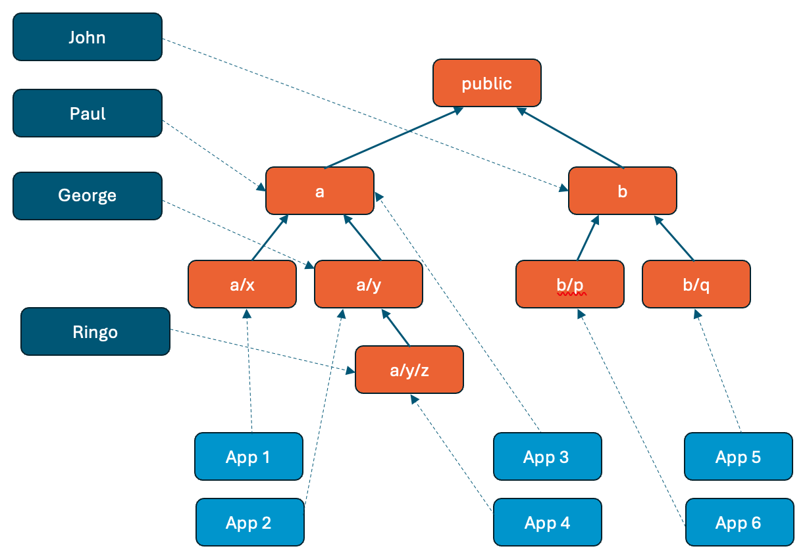
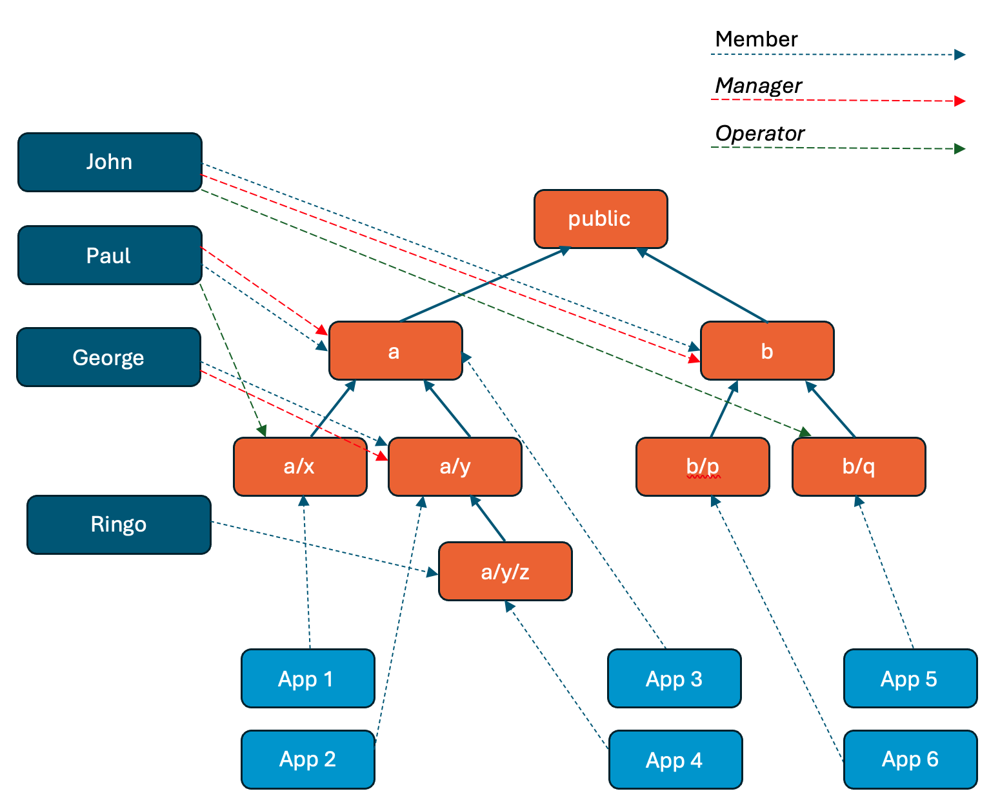

<!---
  SPDX-FileCopyrightText: (C) 2025 Intel Corporation
  SPDX-License-Identifier: Apache-2.0
-->
Tenant Notes
============

## Overview

The basic notion is to evolve the catalog API and back-end schema to allow
different "tenants" to each have a different scope of visibility with respect to
the catalog entities and - similarly - to have different scope of operations they
are able to perform over those entities. It is further desirable to have the ability
to establish a nested hierarchy of such scopes, in order to efficiently
subdivide a larger scope into a set of smaller ones. Basis for this subdivision is
unspecified, but it could be geographical, organizational, or something else entirely.

## Realm

Let's call this scope of visibility a "realm". Furthermore, let's allow realms to exist
in a tree hierarchy rooted in a single top-level realm.

Individual catalog items, such as publishers, registries, artifacts, applications and deployment
packages, would each be associated with a particular realm, thus forming a set of items visible in that
realm.

Visibility within a specific realm, say "a/x", implies visibility of entities associated with ancestors, say "a",
and with nested realms, say "a/x/m", or "a/x/m/e". However, not between siblings, e.g. "a/x/m" and "a/x/n".

The following diagram illustrates the relationship between tenants, realms and catalog entities, though in this
example just applications are used:

The following matrix describes the effect in terms of visibility alone, i.e. read permissions.

| Tenant | Visible Entities           |
|--------|----------------------------|
| John   | App 5, App 6               |
| Paul   | App 1, App 2, App 3, App 4 |
| George | App 3, App 2, App 4        |
| Ringo  | App 3, App 2, App 4        |

In short, the higher in the realm hierarchy a tenant is bound to, the more entities they can see. Conversely, the
higher in the realm hierarchy an entity is bound to, the more tenants can see it.

Note that the update/delete permissions to operate on these entities would be granted separately, but should be
congruent with the read permissions, i.e. one must be able to update/delete only what they are allowed to read.
More on this in a subsequent section on permission management.

## Authorization

Given that this mechanism will not only limit the scope of visibility, but also the scope
of permissible operation, it is natural for it to lean heavily on the authorization mechanism,
which will require enhancements in order to accommodate the notion of realm.

It is assumed that a user (or a principal) will be associated with one "tenant" via
the authentication token. The "tenant" field in the token would then be mapped to a specific realm.
The roles associated with the user identity (either directly or indirectly via groups) will be
used in conjunction with the "realm" derived from the tenant field in the token to provide the
base of the authorization query tuple: (_who can do what_, _in which realm_).

Permissions in a parent realm (e.g. "a"), transcend to permissions in descendant realms
(e.g. "a/x", "a/x/y"), unless they are overridden in descendant realms.

## Realm and Permissions Management

In order to consistently manage the set of available realms, which entities belong to which realm, which tenants map
to which realm, and what tenant roles apply, there should be a subsystem with its own API whose responsibility would
be to track these bindings and to delegate them as necessary to other subsystems for enforcement. Furthermore, the
system should allow for granting and tracking additional update/delete permissions for tenants and roles relative to 
different realms within tenants' chain of visibility.

This would provide a central mechanism to manage visibility and permissions across the entire solution, while allowing
some degree of freedom to individual subsystems to optimised for performance of queries and for authorizing requests.
It is envisioned that the rules would be translated/compiled into REGO rules for enforcement of access via
Open Policy Agents.

Part of the responsibility of this system is to enforce congruency of the various permissions. For example, to make sure
that any update/delete permissions are consistent with the realm bindings, i.e. accompanied by appropriate read
permissions.

The following illustrates the assignment of roles to tenants with respect to different realms.

The following matrix describes the effective permissions for the tenants in the various realms:

| Tenant | Visible Entities           | Additional Roles for Entities                      |
|--------|----------------------------|----------------------------------------------------|
| John   | App 5, App 6               | Manager for App 6; Operator for App 5              |
| Paul   | App 1, App 2, App 3, App 4 | Manager for App 3, App2, App 4; Operator for App 1 |
| George | App 3, App 2, App 4        | Manager for App 2, App 4                           |
| Ringo  | App 3, App 2, App 4        | _None_                                             |

## Application Catalog Entities

Each of the following entities would be associated with one, and only one "realm".

### Publisher and Registry

* A publisher may be visible by anyone or only by select set of "tenants".
* If a publisher is _not_ visible to a tenant, _neither_ are any of the entities associated with it.
* If a registry is _not_ visible to a tenant, _neither_ are any of the applications associated with it.
* Operations (creation, update and deletion) require distinct permissions, not dependent on a "realm".

### Artifacts, Applications and Deployment Packages

* Operations (creation, update and deletion) require distinct permissions, tied to a specific "realm".

## Broader Applicability

Clearly, in designing support for tenants, we also need to make sure that the concepts can be
consistently applied in a broader context of the entire Edge Orchestrator product, and not just the application
catalog subsystem. This means that the notion of realms can be applied in the context of ADM or ARM subsystem-specific
permissions also.

